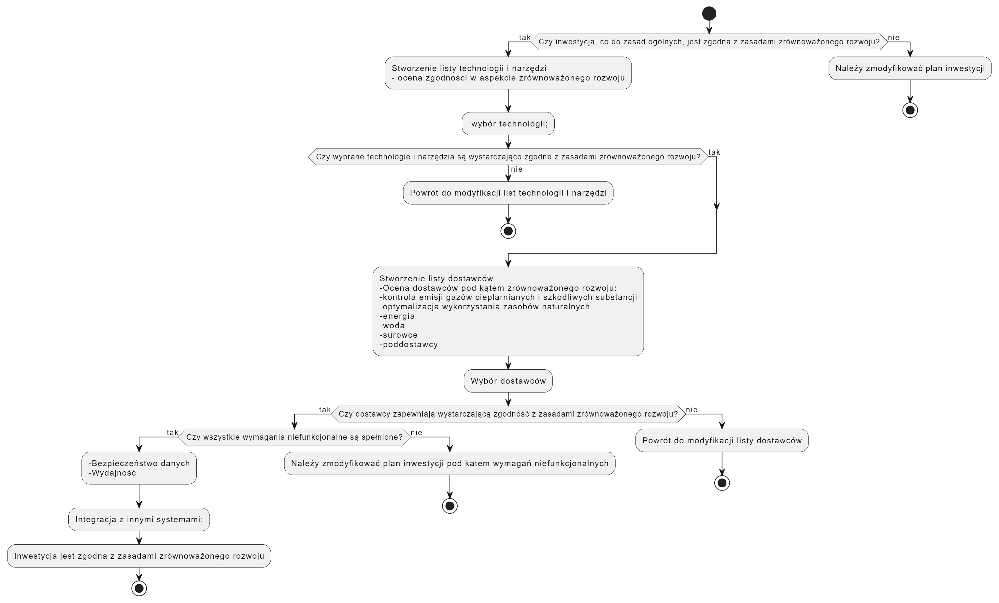

# Opis zadania

Opis sytuacyjny:
*Znana globalna marka, produkująca m.in. napoje, zdecydowała się na zrealizowanie nowej fabryki. Przestrzega zasad **Sustainable Development**.*

Założenia odnośnie wykonanej pracy:
- W opracowaniu tym pomijamy elementy oprogramowania specyficzne dla wsparcia omawianej inwestycji, a nie mających znaczenia z w odniesieniu do elementów **Sustainable Development** jako znaczoąco wykraczające poza tematykę pracy,
- Zakładamy również, że inwestycja jest zlokalizowana na terenie Unii Europejskiej

## Zadanie 1

### 1.

Propozycja wymagań funkcjonalnych oprogramowania wspierającego realizację planowanej inwestycji:
* Ocena dostawców:
  * Zarządzanie dokumentami audytów dostawców wg definiowego przez Użytkownika formularza oceny Dostawców, zawierającego elementy odnoszące siędo zasad zrównoważonego rozwoju, takich jak etyczne praktyki, środowiskowe certyfikaty, odpowiedzialność społeczna, itp.
  * Uwzględnianie w ocenie dostawców elementów **zrównoważonego rozwoju**, umożliwiając ocenę i wybór partnerów biznesowych, którzy również przestrzegają zasad zrównoważonego rozwoju. 
* Wsparcie wyboru technologii / narzędzi z przewidzianych do stosowania w fabryce w trakcie jej budowy i późniejszej eksploatacji pod kątem ich
  * energoszczędności,
  * zużycia zasobów naturalnych, takich jak energia, woda i surowcó, w celu optymalizacji ich wykorzystania,
  * produkcji odpadów: system powinien pomagać w monitorowaniu i zarządzaniu odpadami w fabryce, umożliwiając identyfikację sposobów redukcji, recyklingu i odzysku odpadów.,
  * emisji gazów cieplarnianych oraz innych szkodliwych substancji

Wymagania niefunkcjonalne:
  * Bezpieczeństwo danych: System powinien zapewniać odpowiednie zabezpieczenia danych, aby chronić informacje dotyczące zrównoważonego rozwoju i działalności fabryki.
  * Wydajność: System powinien być wydajny i responsywny, aby umożliwić szybką analizę danych i generowanie raportów związanych z zrównoważonym rozwojem.
  * Integracja z innymi systemami: Oprogramowanie powinno być zdolne do integracji z innymi systemami w fabryce, takimi jak system zarządzania produkcją czy system monitoringu środowiskowego.

### 1.1
Istniejące dokumenty, opisujące cele związane ze zrównoważonym rozwojem, które wpływają na zakres tworzonego oprogramowania:

- Agenda 2030
   - Diversity w zakresie dobory kadr (równowaga płci)
   - Dobór dostawców i technologii z uwzględnieneiem rozsądnego zarządzania surowcami i energią
   - Używanie nowych technologii wspierających innowacyjność (jak IoT, AI)
   - 'Zero waste' w celu zapewnienia zrównoważonej konsumpcji i produkcji
   - Więcej: https://www.gov.pl/web/rozwoj-technologia/cele-zrownowazonego-rozwoju
- Dyrektywa CSRD
  - Zgodność systemu zbierania informacji o dostawcach z wymogami dyrektywy
  - więcej: https://www.gov.pl/web/fundusze-regiony/raportowanie-spoleczne

### 1.2
Drzwwo decyzyjne wspierania decyzji przy planowaniuinwestycji  inwestycji.  

## Zadanie 2

Utrzymanie produkcji w zgodności z celami klimatycznymi może obejmować:
- Monitorowanie istotnych elementów procesu produkcji, takich jak:
  - zużycie energii
  - zużycie surowców
- System rekomendacji, bazujący na monitorowanych pomiarach, regularnie dostarczany użytkownikom, dotyczący możliwych ryzyk, zmian w systemie, za;ecanych usprawnień
- Podejmowanie przez System autonomicznych decyzji w starannie dobraych obszarach, jak np.
  - preferowanie źródeł (energetycznych i surowcowych) odnawialnych, uzupełnianych zapasowymi wg potrzeb.
  - okresowe wyłączannie elementów produkcyjnych na podstawie przewidywanego zmniejszonego popytu. Przewidywanie budowane z użyciem AI na podstawie danych historycznychw
- Monitorowanie i reakcje powinny odbywać się w czasie rzeczywistym
